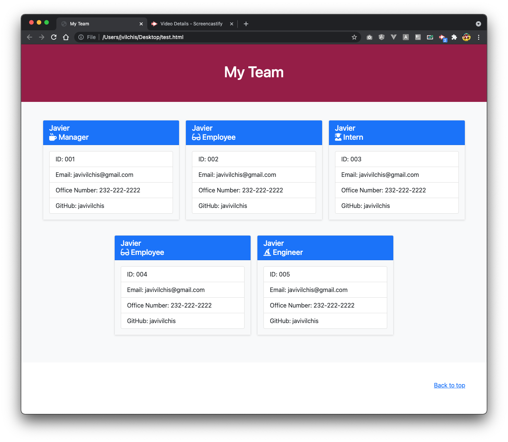

# Team Dashboard Generator

## Your Task

The Objective is to create a Dashboard that generates a Team Member sitemap to help the Different teams be knowleadgeable of who is who in the team. 

## Mock-Up

The following image capture shows the mockup to be seen when the html document is generated.



You can take a look at the video on how it will look like when it is all done.
[Mockup Video of HTML ](https://drive.google.com/file/d/1LtFMlYgtgDPJ-9TZXoSYkGgQdh6BHJsb/view)

## How to use

Download the code and follow the following steps to get it going:

* Using your terminal console run the following command:
```
node index.js
```
* answer the prompted questionaire
* once you are done answering the questions you will see an HTML file document generated.

## Questions?

Please contact javivilchis@gmail.com with any questions you might have about this code. 

Enjoy!